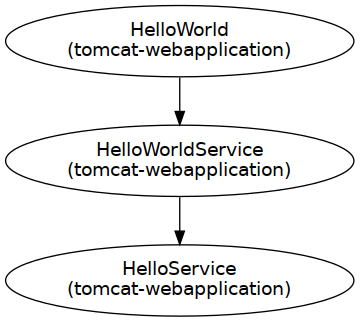
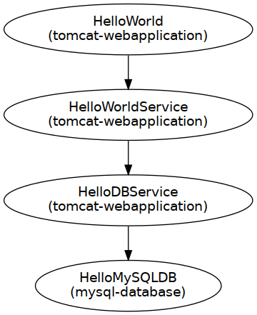

disnix-composition-example
==========================
This is a trivial example case demonstrating various ways to compose services
together. The simplest composition is done by just inheriting the dependency with
the same name from the same lexical scope. Another example demonstates an
alternative and more complex composition of the same service.

For each upgrade, services must be rebuilt (because the contents of configuration
files change) which makes upgrades expensive in some cases. This example also
demonstrates two variants to *dynamically* compose services together, so that in
case of an event in which the location changes no rebuilds are required.

Architecture
============
We have several architecture variants in this example. What all variants have in
common is that they have a `HelloService`, a web service returning the string:
'Hello', a `HelloWorldService` web service, which attaches the string ' world!'
to 'Hello' and a web application front-end displaying the result.

Simple variant
--------------

The above figure shows the architecture of the simplest variant of this example.
In this architecture a `HelloService` component is shown which returns the string
'Hello'. The `HelloWorldService` retrieves the 'Hello' string to generate the
sentence: 'Hello World!'. The `HelloWorld` web application displays the result.

Alternative variant
-------------------

The second figure shows an architecture using an alternative composition -- in
this variant, a web service called `HelloDBService` is used retrieving the Hello
string from a MySQL database instead of the ordinary `HelloService`.

Lookup variant
--------------

The third variant shown in dynamically binds service together using a
`LookupService` which knows about the locations of all services. The architecture
uses different variants of the web application front end and the
`HelloWorldService` which are lookup service aware. By using a lookup service no
rebuilds are required of all the other services (except when the location of the
lookup service changes).

Load balancing variant
----------------------

The fourth variant uses a load balancer using the round-robin scheduling method
to forward request to multiple instances of the same service, to achieve a
simple form of load balancing.

Cyclic variant
--------------

The last variant composes two services together that are mutually dependent on
each other. To allow such kinds of deployments, we must use a special attribute
in the Disnix deployment system specifying that the activation order does not
matter.

Both services are servers and clients at the same time. They consult each other
to obtain the 'Hello world!' message and display the result.

Usage
=====
The `deployment/DistributedDeployment` contains all neccessary Disnix models,
such as a services, infrastructure and distribution models required for
deployment.

Deployment using Disnix in a heterogeneous network
--------------------------------------------------
For this scenario only installation of the basic Disnix toolset is required.
First, you must manually install a network of machines running the Disnix
service. Then you must adapt the infrastructure model to match to properties of
your network and the distribution model to map the services to the right
machines.

To deploy the databases you must install [MySQL](http://www.mysql.com).
To deploy the web services and web application services you must install
[Apache Tomcat](http://tomcat.apache.org). Check the instructions of your Linux
distribution or the software distributions themselves how to install these system
services. Dysnomia detects the presence of these system services and configures
the corresponding modules to use them.

The system can be deployed by running the following command:

    $ disnix-env -s services-simple.nix -i infrastructure.nix -d distribution-simple.nix

The `service-simple.nix` and `distribution-simple.nix` files can be replaced by
the models for the other variants, such as `service-lookup.nix`.

Hybrid deployment of NixOS infrastructure and services using DisnixOS
---------------------------------------------------------------------
For this scenario you need to install a network of NixOS machines, running the
Disnix service. This can be done by enabling the following configuration
option in each `/etc/nixos/configuration.nix` file:

    services.disnix.enable = true;

You may also need to adapt the NixOS configurations to which the `network.nix`
model is referring, so that they will match the actual system configurations.

The system including its underlying infrastructure can be deployed by using the
`disnixos-env` command. The following instruction deploys the system including
the underlying infrastructure.

    $ disnixos-env -s services-simple.nix -n network.nix -d distribution-simple.nix

The `service-simple.nix` and `distribution-simple.nix` files can be replaced by
the models for the other variants, such as `service-lookup.nix`.

Deployment using the NixOS test driver
--------------------------------------
This system can be deployed without adapting any of the models in
`deployment/DistributedDeployment`. By running the following instruction, the
variant without the proxy can be deployed in a network of virtual machines:

    $ disnixos-vm-env -s services-simple.nix -n network.nix -d distribution-simple.nix

The `service-simple.nix` and `distribution-simple.nix` files can be replaced by
the models for the other variants, such as `service-lookup.nix`.

Deployment using NixOps for infrastructure and Disnix for service deployment
----------------------------------------------------------------------------
It's also possible to use NixOps for deploying the infrastructure (machines) and
let Disnix do the deployment of the services to these machines.

A virtualbox network can be deployed as follows:

    $ nixops create ./network.nix ./network-virtualbox.nix -d vboxtest
    $ nixops deploy -d vboxtest

The services can be deployed by running the following commands:

    $ export NIXOPS_DEPLOYMENT=vboxtest
    $ disnixos-env -s services-simple.nix -n network.nix -d distribution-simple.nix --use-nixops

The `service-simple.nix` and `distribution-simple.nix` files can be replaced by
the models for the other variants, such as `service-lookup.nix`.

Running the system
==================
After the system has been deployed, open a web browser and type the following URL:

    http://test1:8080/HelloWorld

The `test1` hostname must be replaced by the real hostname of the machine to
which the web application front-end is deployed. Check the distribution model for
this. If the network expression is used included in this example, the third
machine in the network machine automatically boots into IceWM and includes the
Mozilla Firefox web browser for convenience.

License
=======
This package is released under the [MIT license](http://opensource.org/licenses/MIT).
